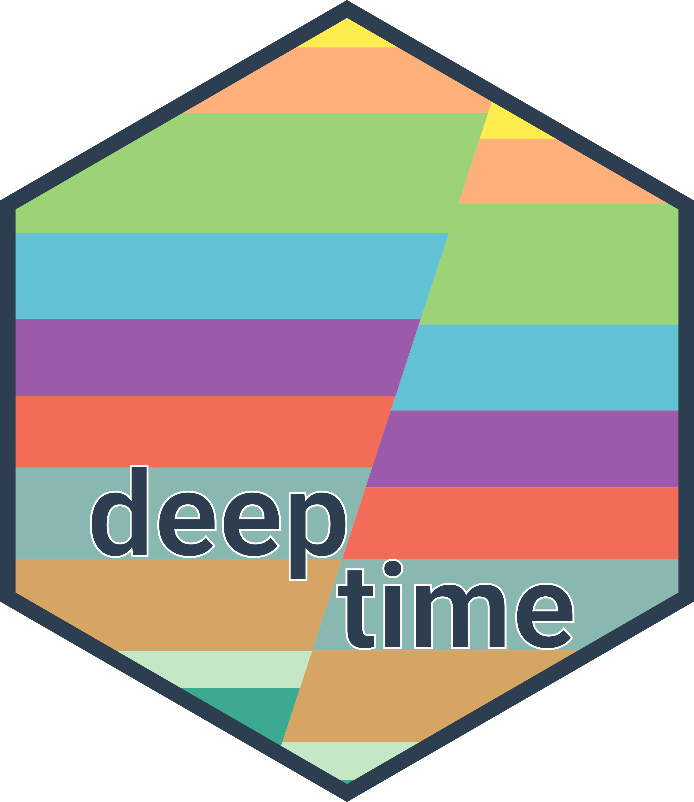

# deeptimedata 

<!-- badges: start -->
[](https://CRAN.R-project.org/package=deeptimedata)
[](https://github.com/willgearty/deeptimedata/actions/workflows/R-CMD-check.yaml)
<!-- badges: end -->

## Overview
An R package that contains geologic pattern data from the Federal Geographic Data Committee (FGDC) and United States Geological Survey (USGS) as put forward in the [Digital Cartographic Standard for Geologic Map Symbolization](https://ngmdb.usgs.gov/fgdc_gds/geolsymstd.php). Access functions are provided in the accompanying [deeptime](https://williamgearty.com/deeptime/) package.

## Installation

Generally, you should not need to install this package separately, it should be installed automatically when installing the `deeptime` package. However, if you do need to install it on it's own, you can use either of these options:

```r
# get the stable version from CRAN
install.packages("deeptimedata")

# or get the development version from github
# install.packages("devtools")
devtools::install_github("willgearty/deeptimedata")
```

## Citation

If you use the `deeptime` and/or `deeptimedata` R packages in your work, please cite as:

Gearty, W. 2024. deeptime: an R package that facilitates highly customizable visualizations of data over geological time intervals. EarthArXiv. doi: [10.31223/X5841N](https://doi.org/10.31223/X5841N).
